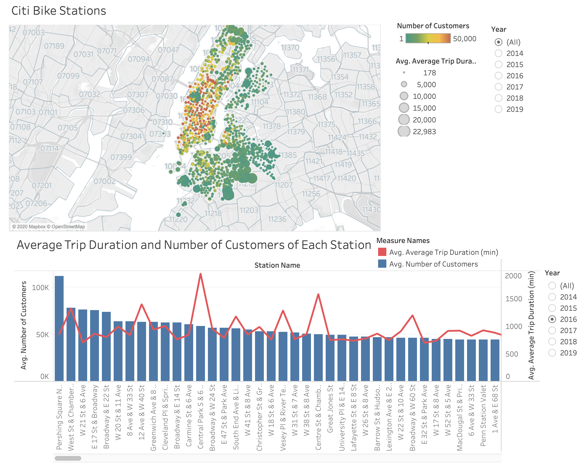
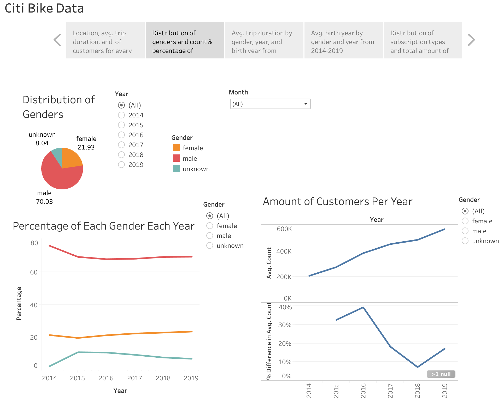
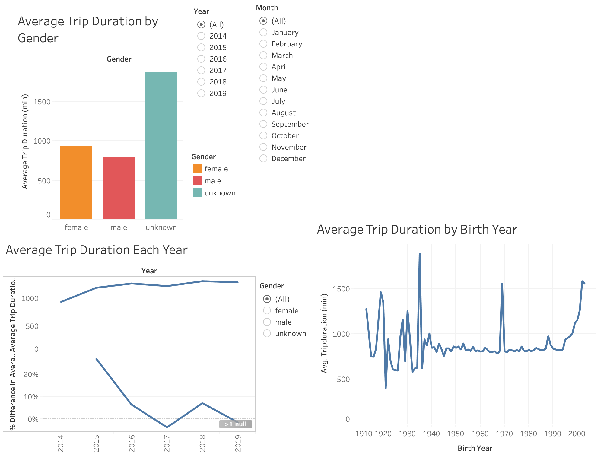
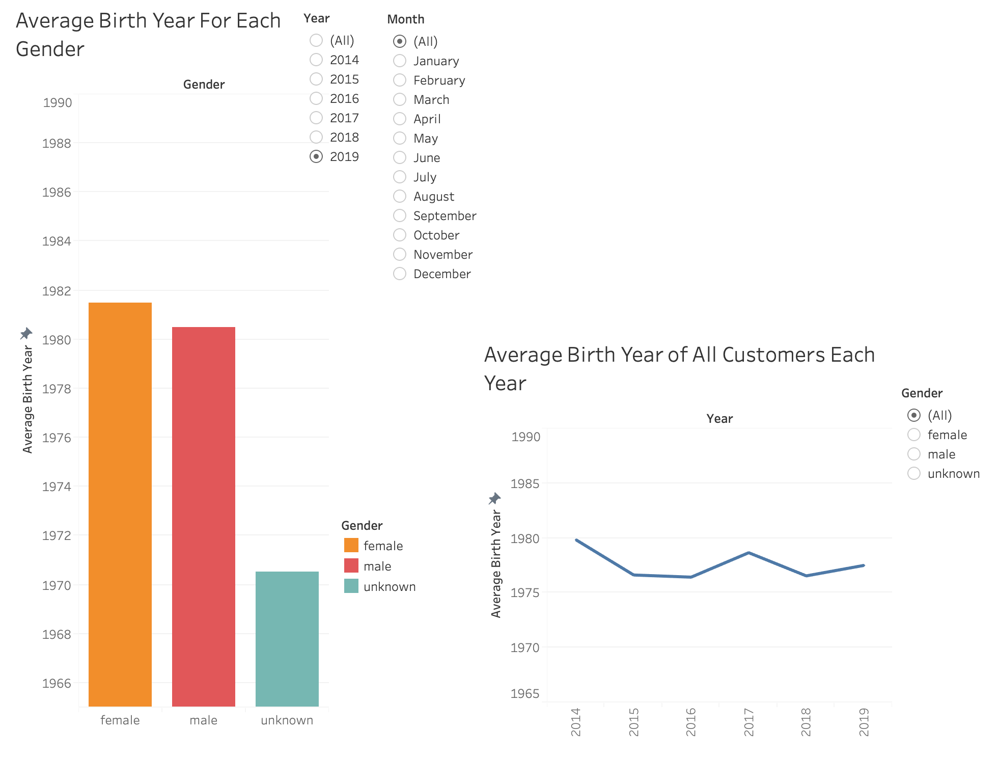
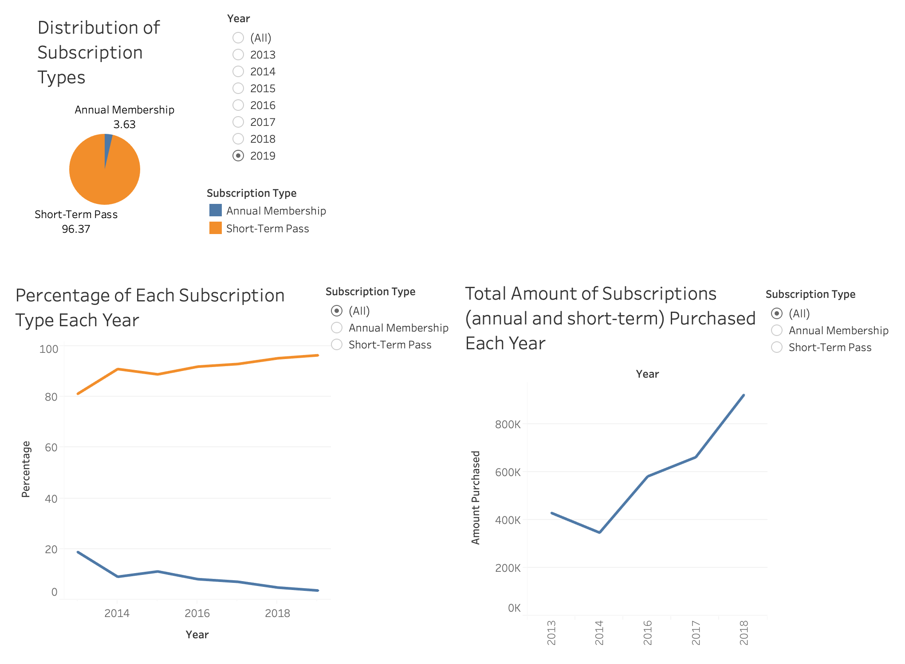

### Link to Tableau Workbook:
[https://prod-useast-a.online.tableau.com/#/site/sandrafroonjianstableausite/workbooks/193078/views](https://prod-useast-a.online.tableau.com/#/site/sandrafroonjianstableausite/workbooks/193078/views)

### Purpose of this analysis:
The purpose of this analysis is to use Citi Bike's data to generate interactive visuals on Tableau to try to improve the program.

---

**Station Data:**
1. The first trend illustrated by the map is that from 2014-2019, the amount of bike stations has greatly increased and spread throughout more parts of NYC.
    1. This trend may be occurring simply because Citi Bike was so successful that it expanded the amount of stations and areas the stations were located. Customers benefit from this too since they now have more option of where to start and end their trip, and they can venture our to further places of NYC.
1. The second trend illustrated by the map is that the stations that have the greatest amount of customers (shown in red) are the stations located in the center and eastern side of NYC.
    1. This trend may be occurring because that is where many scenic and popular attractions in NYC are located, such as Central Park, Times Square, and the Hudson River.
1. The third trend illustrated by the map is that the stations with customers that take the longest bike trips (indicated by the size of the circle) are the stations located on the outer sountern, western, and northern bounds of all the stations.
    1. This trend may be occurring because those locations are further from where many of the scenic and popular attractions are located. Therefore, it would take longer for people to ride to them.

**Gender Data:**
1. The first trend illustrated by this dashboard is that the percentage of customers that female has slowly increased from 2014-2019, however, every year, the vast majority of customers are male.
    1. This means that although gender outreach has been somewhat effective at increasing female ridership, it could still use some work. Perhaps advertisements that are better targeted for women or sponsoring female organizations would increase female ridership even more.
1. The second trend illustrated here is that the total amount of customers has steadily increased every year.
    1. This is not surprising considering the fact that Citi Bike has been so successful and has expanded the amount of stations and the areas where the stations are located.

**Trip Duration Data:**
1. The first trend illustrated by this dashbaord is that every year, customers whose gender is unknown have the highest average trip duration, females have the second highest, and males have the lowest. Also, each gender increased in the average trip duration from 2014-2019.
    1. This may be due to a couple of reasons. First, maybe females, on average, have a higher stamina than males and can ride for a longer time, or maybe males, on average, are faster at riding and can finish their trip sooner. Neither of these reasons can be said for sure though without further research.
1. Another item illustrated by this dashboard is the average trip duration by birth year. Based on the chart, there doesn't seem to be a correlation between birth year and trip duration. There also appears to be a few crazy flunctuations/outliers, especially for very old customers.
    1. This may be due to couple reasons. First, that riding bikes is a fun, healthy, and safe activity for all age levels, and second, that some customers must not have been truthful about their birth year.

**Birth Year Data:**
1. The first trend illustrated by this dashboard is that every year, females have a higher average birth year than males, meaning compared to the male customer population, the female customer population is, on avearge, slightly younger.
1. The second trend illustrated by this dashboard is that the average birth year for both males and females increases every year. For eery year that the dataset increases, so does the average birth year for males and females. This means that every year, the average age of females every year is 38 and the average age of males is 39.
    1. This trend may be occurring because people in their high 30's are generally still active, healthy, and mobile. They are also generally more financially stable and settled than people in their 20's, so they are probably more likely to be able to afford doing hobbies like bike riding.

**Membership Data:**
1. The first trend illustrated by this dashboard is that the percentage of annual memberships slowly decreases over time, while the percentage of short-term passes steadily increases over time. Also, the vast majority of customers buy short-passes over annual memberships.
1. The second trend illustrated by this dashboard is that amount of subscriptions (both annual and short-term) has increased over the years.
    1. Once again, this is not surprising considering the fact that Citi Bike has been so successful and has expanded the amount of stations and the areas where the stations are located.
    1. One thing to note about this chart is that the years 2015 and 2019 have not been included. This is because the data from quarter 3 2015 was not available on Citi Bike's website, and only quarter 1 and 2 were available for 2019. Therefore, I chose to leave those 2 years out of this chart to avoid the data from years appearing lower than they actually were.

---

### Data collected:

